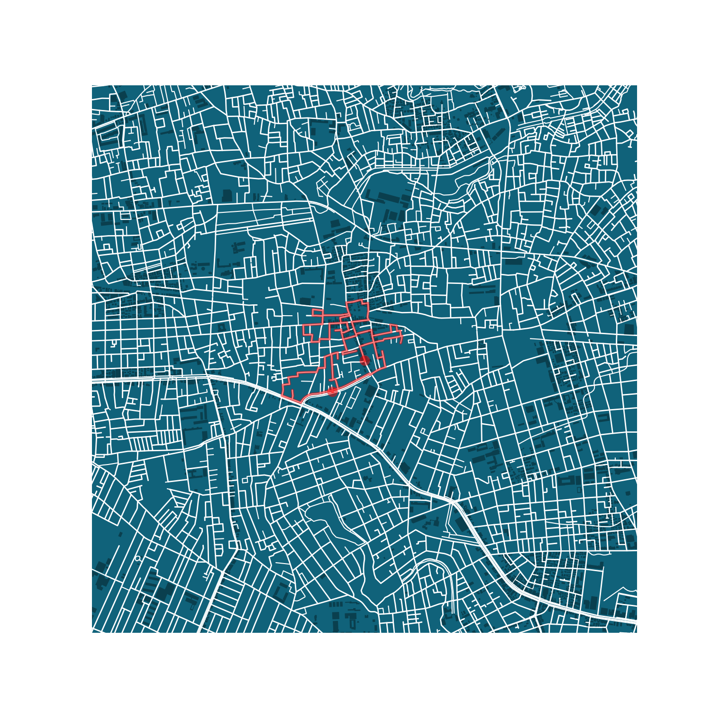

# flânerie

Randomly generated amble walks.

## Usage

```
$ python3 generate.py --help
Usage: generate.py [OPTIONS]

  Generate random amble walks based off of a starting point and a minimum
  target distance.

  e.g. python3 generate.py --start 52.46794 13.31386 --min-distance 5000

Options:
  --start FLOAT...             Starting point as GPS coordinate, first
                               latitude, then longitude.  [required]

  --bbox-distance INTEGER      Distance of bounding box in meters from
                               starting point.

  --min-walk-distance INTEGER  Minimum distance of generated walk in meters.
                               [required]

  --help                       Show this message and exit.
```

## Example routes


A walk starting from the Nerima ward in Tokyo, Japan. See exact starting point on [OpenStreetMaps](https://www.openstreetmap.org/#map=19/35.72411/139.59118).
